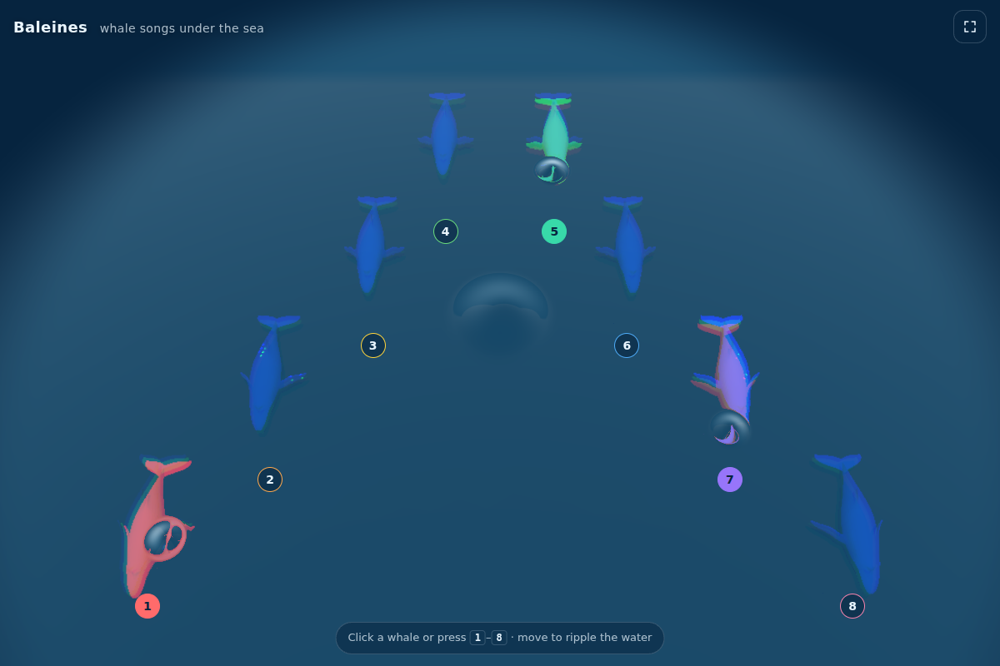

# Baleines — play whale songs on a WebGL sea

Try it live: https://pmalhaire.github.io/threejs-caustics



Eight whales rest under a real-time simulated sea. Make them sing:

- **Click / tap** a whale, or its number pad
- **Keys `1`–`8`** (top row or numpad — works on AZERTY keyboards too, no Shift needed)
- **Move** the mouse to ripple the water
- **`F`** toggles fullscreen

Each singing whale lights up in its own color and sends a ripple through the water; the light
focused by the waves (caustics) dances on the whales and the sea floor.

## Running locally

Any static file server works, e.g.

```sh
python3 -m http.server
```

then open http://localhost:8000.

## How it works

- `index.js` — scene setup, water simulation, caustics and environment passes, interactions
- `shaders/` — GLSL for the water height-field simulation, the water surface, the caustics
  and the lit environment (whales + sea floor)
- Sounds are played with the Web Audio API (low latency, stereo placed by whale position)
- three.js r117 is loaded from jsDelivr

Forked as a direct application from https://github.com/martinRenou/threejs-caustics

Implementation details: https://medium.com/@martinRenou/real-time-rendering-of-water-caustics-59cda1d74aa
